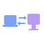

  

Scrum Master who codes on the side. If something's broken or tedious, I'll probably write a script for it.

  
  

---

## Featured Projects

<table>
<tr>
<td width="50%">

###  [Cortex](https://github.com/robertogogoni/cortex-claude)

**Claude's Cognitive Layer** - Dual-model memory system with auto-extraction, vector search, and MCP tools for deep reasoning.

</td>
<td width="50%">

###  [claude-cross-machine-sync](https://github.com/robertogogoni/claude-cross-machine-sync)

**Cross-Machine Claude Sync** - Cross-machine sync for Claude Code settings, memory, and configurations with auto-categorization and background daemons.

</td>
</tr>
</table>

---

## Other Projects

<table>
<tr>
<td width="50%">

###  [awesome-beeper](https://github.com/robertogogoni/awesome-beeper)

Curated list of Beeper resources, tools, and community projects.

</td>
<td width="50%">

###  [update-beeper](https://github.com/beeper-community/update-beeper)

Self-healing Beeper Desktop updater for Arch Linux.

</td>
</tr>
</table>

---

## Tech Stack

  
  
  
  
  
  
  
  

---

## GitHub Stats

  
  

  

<b>More Stats</b>

 

  

  

  

<picture>
  <source media="(prefers-color-scheme: dark)" srcset="https://raw.githubusercontent.com/robertogogoni/robertogogoni/output/github-snake-dark.svg">
  <source media="(prefers-color-scheme: light)" srcset="https://raw.githubusercontent.com/robertogogoni/robertogogoni/output/github-snake.svg">
  
</picture>

---

  

